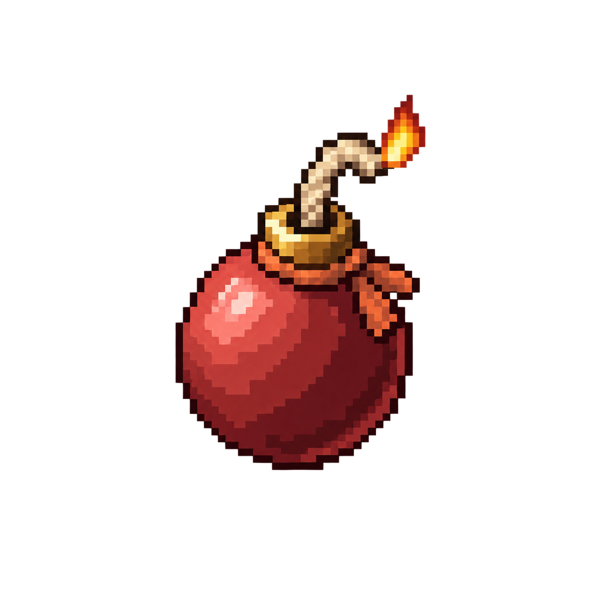

# El bosque se mantiene solo

Plan de trabajo para quien lo implemente. Dos problemas y una sola idea detrás: **el bosque se
regula por el mundo y por la gente, no por reglas administrativas ni por paneles de moderación.**

1. **Los caminos se autolimitan** — que no se pueda pelar el bosque entero de senderos.
2. **La bomba** — una forma de quitar lo que hizo otra persona, cara, escasa y social.

Las decisiones de producto de abajo **están tomadas por el dueño**. La sección *Lo que NO se hace*
existe para que nadie las vuelva a abrir con buena intención.

---

## 0. Decisiones cerradas (no reabrir)

- Los **caminos no se bombardean**: su regla es la de los caminantes (§A3). La bomba es para lo
  demás.
- **No hay ventana de gracia** al construir: cuando está hecho, está.
- **La reputación no participa** en la bomba. Lo que la regula es lo difícil que sea encontrarla.
- **No hay techo duro por zona** para los caminos: solo el precio, que sube exponencialmente hasta
  hacerlo imposible en la práctica.
- **No hay NPC que desmonten** nada. Lo que retira es la bomba, y la hierba se la come el tiempo.
- **No hay papelera nueva ni panel de moderación.** El historial de auditoría que ya existe
  (`game_community_history`) se hereda gratis por usar el mismo camino de retirada, y con eso basta.
- **No hay unanimidad ni votación** para retirar. Se descartó a favor de la bomba.
- Desactivar una bomba **no avisa a nadie**: desaparece y punto.
- Lo que coloca el dueño desde el Studio **no se toca jamás** (ya lo cubre `protected`).

---

## 1. Lo que YA existe (no reinventar nada de esto)

Media cocina está montada. Antes de escribir una línea, leer:

| Pieza | Dónde | Qué hace ya |
| --- | --- | --- |
| Definiciones de construcción | `data/aventura/construction.json` | `cost` / `costPerTile`, `surfaces`, `capabilities`, `maxPerAuthor`, `separation`, `removeCost`, `removeLabel`, `footprint` |
| Topes globales | mismo fichero | `maxObjectsPerZone: 96`, `maxObjectsPerAuthor: 24`, `zones[].maxObjects`, `zones[].protected` |
| **`foreignEditsEnabled: false`** | mismo fichero | El interruptor de «editar lo ajeno». **Se queda en false**: la bomba NO es una edición ajena, es su propia operación con su propia autorización |
| **`heritage`** | mismo fichero + `community.php` | Un objeto con ≥`minimumDays` (28) y ≥`minimumVisitors` (10) queda **intocable hasta para su autor** (`heritage_protected`) |
| Geometría y coste | `public/assets/js/adventure/construction-layout.js` | `objectCost`, `polylineLength`, `polylineReason`, `validateConstruction`, `groundMask`, `maskFromRows` |
| **Gemelo en PHP** | `src/game/community.php` (repo web) | La MISMA geometría: `communityObjectCost`, `communityValidate`, `communityNeighbourhoodReason`… |
| Operaciones | `community.php` | `place`, `move`, `remove`, con bloqueo de zona `FOR UPDATE`, `zoneRevision` y conflicto por revisión de objeto |
| Coste de quitar | `community.php` | Si la definición declara `removeCost` se **paga** (el camino cuesta una semilla y no devuelve nada); lo demás devuelve sus materiales |
| Auditoría | `game_community_history` | `before_json` / `after_json` por operación, y un restaurador solo de moderador (`communityRestoreHistory`) |
| Borrado blando | `game_community_objects.removed_at` | Ya existe. La retirada no borra la fila |
| Confianza | `game_accounts.trust` (0-100) | Sube cuando **otra persona** usa algo que construiste (`communityUse`). **No son setines** y no se canjea |
| Visitantes por objeto | `game_community_visitors` + `unique_visitors` | Quién ha usado cada cosa |
| Autoridad viva | `bosque-vivo/` + `scripts/forest-storage.php` | Presencia, índice espacial por escena, índice de construcciones, `forestConstructionBegin/End` (arriendo de zona) |
| Notas del bosque | `forest-notes.js` + `check-forest-notes.cjs` | Texto libre de la comunidad con su política (500 caracteres, herramientas, alcance) |
| Avisos | `src/functions-avisos.php` (repo web) | Tipos, canales, preferencias, techo semanal, baja sin sesión |

Esquema vigente de `game_community_objects`: `id, zone_id, kind, variant, x, y, rotation,
points_json, creator_id, revision, times_moved, unique_visitors, heritage, removed_at, created_at,
updated_at`.

> Producción tiene **4 objetos comunitarios** hoy. Todo lo que sigue se diseña para cuando haya
> cientos, pero **los números hay que medirlos cuando los haya** (§5).

---

## Parte A — Los caminos se autolimitan

### A1. El precio sube exponencialmente con lo que ya hay en la zona

**El problema real**: un tope por persona no protege el bosque. Con ocho vallas por cabeza y cien
personas, el claro se pela igual. El límite tiene que ser **del sitio**, no de quien construye.

**La regla**: el coste por celda se multiplica por cuánto de esa zona está ya cubierto por objetos
de su MISMA familia.

```
cubiertas(zona, familia) = Σ ceil(polylineLength(puntos))   de los objetos vivos de esa familia
pisables(zona)           = celdas a 1 de groundMask dentro de la zona
d                        = cubiertas / pisables
multiplicador            = 2 ^ (d / D)
coste(material)          = ceil(costePorCelda × celdas × multiplicador)
```

`D` es la **fracción de duplicación** y vive en la definición del objeto
(`construction.json → definitions[kind].densityDoubling`). Sin esa clave, multiplicador 1: así los
bancos y las flores no se enteran de nada y solo lo pagan los que de verdad cubren suelo.

Con `D = 0.02`: al 2% de la zona cubierta cuesta el doble, al 6% ocho veces, al 10% treinta y dos,
al 20% mil. **Sin muro**: nunca dice que no, simplemente deja de ser pagable. Esto es exactamente lo
que se pidió — «al subir de forma exponencial será cada vez más difícil o imposible de ponerlo».

**Detalles que no son opcionales:**

- ⛔ **El precio que se enseña es el precio que se cobra.** Se calcula de las MISMAS filas y la
  MISMA revisión de zona que usa la validación. El servidor ya rechaza con `zone_conflict` si la
  revisión se movió mientras decidías, así que no puede cobrarte una cifra distinta de la que viste.
- `objectCost` / `communityObjectCost` **cambian de firma**: necesitan el estado de la zona. Hay que
  tocar los DOS gemelos y todos sus llamantes (cliente, servidor, restaurador de historial).
- `pisables(zona)` se calcula una vez y se cachea: es la máscara de suelo, que no cambia salvo que
  el dueño redibuje la pantalla en el Studio. Cachear por `(zona, id de release)`.
- El precio de **mover** no se recalcula (mover ya no cobra, y hay un comentario en `community.php`
  explicando por qué: si al mover se pudiera redibujar, se colocaría una valla de un tile y se
  estiraría gratis).
- Cuando el multiplicador pasa de ~4, la barra debería decir por qué: una clave de idioma × 6
  («este claro ya está muy pisado»). No es un error, es información.

### A2. El material es el cuello de botella

La regla más sana de todo el plan, y la más barata: **construir tiene que ser una consecuencia de
jugar**. Si el material del camino se recoge rápido y cerca, ninguna regla de A1 aguanta.

- El material de los caminos debe salir de un sitio al que haya que **ir**, y de un nodo con ciclo
  lento (`data/aventura/resource-nodes.json`, un bit por nodo y ciclo por región).
- Y debería ser **distinto** del material de las vallas: así lo que construye cada persona cuenta
  por dónde ha estado, y el bosque acaba pareciendo un mapa de lo que la gente hace.
- Esto es **dato, no código**: `costPerTile` y el nodo. Lo decide el dueño.

### A3. La hierba vuelve (el corazón del plan)

**Un tramo de camino que nadie pisa se cubre de hierba solo.** Nadie borra el trabajo de nadie: lo
hace el bosque. Y el efecto de producto es el que se busca — los caminos que la gente usa se quedan,
los caprichos se van, y **el camino real emerge del uso**.

#### La unidad es el TRAMO, no el camino

Un camino es una polilínea de hasta 8 puntos, o sea hasta 7 tramos. Muere el tramo, no el objeto.
Así pasa lo bonito: la rama que nadie usa se estrecha y desaparece, y el tronco por el que pasa todo
el mundo se queda.

⛔ **Solo pueden morir los tramos de los EXTREMOS.** El camino se erosiona de las puntas hacia
dentro y nunca se parte en dos. Si muriera un tramo del medio habría que partir la polilínea en dos
objetos (dos ids, dos autores, dos costes) y eso es un lío que no compra nada. Un tramo del medio
solo se vuelve elegible cuando ya es un extremo.

#### El reloj solo corre cuando hay gente

Si el reloj fuera de pared, el primer camino que alguien construya en una pantalla nueva se moriría
antes de que llegara nadie a usarlo. Con catorce cuentas eso pasaría **casi siempre**.

- `game_community_zones` estrena una columna `clock` (unsigned int): **minutos acumulados con al
  menos una persona presente en la escena de esa zona**.
- Lo avanza el demonio por su sidecar (`scripts/forest-storage.php`), un incremento por minuto con
  presencia. Es una escritura por zona y minuto como mucho.
- La edad de un tramo es `clock - ultimaPisada`, nunca una diferencia de fechas.

#### Marcar la pisada

- Lo hace **el demonio**, que es quien tiene la presencia y el índice de construcciones. En su tic,
  para cada jugador **a pie**, busca tramos de camino bajo sus pies y apunta el `clock` actual.
- ⛔ **Como mucho una marca por persona, tramo y minuto**, acumulada en memoria y volcada en lote.
  Nada de una escritura por fotograma.
- Volcado: el máximo `clock` por tramo. No hace falta saber QUIÉN pisó, solo CUÁNDO se pisó por
  última vez.

#### Dónde vive el dato

⛔ **Una columna `steps_json` (TEXT NULL) en `game_community_objects`, no una tabla nueva.** Es un
array corto, un valor de reloj por tramo. Y lo importante: **no lleva ningún id de persona**, así
que no toca el reciclador de anónimos ni `DELETE /api/users/me` (§6). Una tabla nueva con `user_id`
sí los tocaría, y esa trampa ya ha mordido dos veces en esta casa.

#### El barrido

- Vive en el **cron de la web** (cada minuto, acotado con `LIMIT`), porque la web es la dueña del
  almacenamiento y es quien sube la revisión de zona para que los clientes resincronicen solos.
- Un tramo con `clock - ultimaPisada >= overgrowth.minutes` y que sea extremo, se retira.
- Si al camino le quedan menos de dos puntos, **se retira el objeto entero**.
- ⛔ **No devuelve material a nadie.** Si devolviera, sería una granja: pon camino, espérate,
  recoge.
- Pasa por el MISMO camino de retirada que ya existe (revisión de zona, arriendo con el demonio,
  entrada en `game_community_history` con `actor_id` nulo — lo retiró el bosque, no una persona).

#### Se tiene que ver venir

A partir de la **mitad** del presupuesto, el tramo se pinta con hierba asomando por los bordes. Eso
convierte la regla en una lección que se aprende sin leerla: **un camino que se muere se salva
andando por él**. Es arte (§9).

`overgrowth.minutes` vive en `construction.json`, por definición de objeto.

---

## Parte B — La bomba

Quitar lo que hizo otra persona deja de ser una gestión y pasa a ser **una historia**: una bomba con
un mensaje, una mecha, y alguien que pasa por ahí y decide.

La asimetría es lo que sostiene el sistema: **poner cuesta un objeto escaso, desactivar es barato y
heroico**. El troll gasta la única bomba que tiene; el que pasa por ahí la desactiva.

### B1. Dos objetos, y se encuentran por separado

- **`bomba`** y **`desactivador`**, objetos de inventario en `contract.progress.items`.
- ⛔ **Tope 1 de cada uno por cuenta.** Es el modelo mental del dueño («si un trol quiere gastar la
  única bomba que tiene…») y es lo que impide que un paciente acumule veinte y arrase una tarde.
- Se consiguen **superando pruebas**, y **en sitios distintos**: por cada prueba que da una bomba
  hay otra prueba, en otro lado, que da un desactivador.
- ⛔ **Lo concede el servidor**, por el sistema de reglas que ya existe (`data/aventura/behaviors/`
  + `rules.js` + el `game-action` de siempre). Nunca lo reclama el cliente. Eso es lo único que
  separa «hay que jugar para conseguirla» de «hay que saber hacer un POST».
- Una identidad recién acuñada tiene cero bombas, y acuñar una identidad es un clic. Ese es el muro
  antitroll, y es el mismo que el del material de los caminos.

### B2. Colocar

Operación nueva en el mismo escrito validado de `community.php` (mismo bloqueo de zona, misma
revisión, mismo `operationId` idempotente, mismo limitador de escrituras).

**Se coloca sobre UNA pieza concreta y se lleva solo esa pieza.** Nada de radio: el daño colateral
es lo que convierte una mecánica divertida en una putada, y «voy a poner una bomba en ESTA valla» es
una intención clara que además hace que el mensaje signifique algo. Un trozo de valla es una pieza;
un camino entero también lo sería, pero los caminos no se bombardean.

Se rechaza si:

- el objeto no existe, está retirado o no es comunitario;
- es **`heritage`** (28 días y 10 visitantes) — el patrimonio del bosque no se vuela;
- está dentro de un rectángulo `protected` de la zona;
- su definición declara `bombable: false` (así lo decide el dato, no el código). **Los caminos lo
  declaran**: su regla es la hierba;
- ya tiene una bomba puesta;
- quien la pone no lleva una bomba en el saco.

Al colocar: se **consume** la bomba del inventario y se puede dejar **un mensaje**.

⛔ **El mensaje reutiliza la política de las notas del bosque** (misma longitud, mismo saneado, misma
comprobación). Es el único texto libre de persona a persona de todo esto, y no puede haber dos
políticas para lo mismo.

**Columnas nuevas en `game_community_objects`**: `mined_at datetime NULL`, `mined_by int NULL`,
`mine_note varchar(500) NULL`.

> ⛔ `mined_by` es un id de persona: **hay que clasificarlo en el reciclador nocturno de anónimos y
> en `DELETE /api/users/me` en el MISMO commit que la migración.** El reciclador falla cerrado y
> deja de limpiar hasta que alguien lo clasifique; el borrado de cuenta no avisa de nada y se olvida
> en silencio. Ha pasado dos veces (`newsletter_sends`, `expressionario_chat`).

### B3. La mecha

- **Cinco horas de reloj de pared** desde `mined_at`.
- La explosión la dispara el **cron de cada minuto**.
- ⛔ **No se ve de lejos y no molesta.** Ni marcador en el mapa, ni aviso a todo el mundo, ni nada
  que tape el bosque. Es un objeto pequeño al lado de lo que va a volar. El bosque se regula
  socialmente; eso es parte del diseño, no un descuido.
- A **30 minutos** del final parpadea **sutilmente en rojo**. Sutil de verdad.
- ⛔ **La hora la manda el servidor.** El DTO del objeto lleva `explodesAt` como instante absoluto
  (epoch), no «minutos que quedan»: un cliente con la página vieja mentiría. Es el mismo patrón que
  el `data-editable-until` de la web.

### B4. Desactivar

- Se toca la bomba llevando el desactivador en la mano.
- **Consume el desactivador**, limpia `mined_at` / `mined_by` / `mine_note`, sube la revisión de
  zona.
- **No avisa a nadie.** Desaparece y punto.
- Entrada en el historial con la operación `defuse`.

### B5. Explotar

- Retira el objeto por el **mismo camino que una retirada normal**: revisión de zona, arriendo con
  el demonio, entrada en `game_community_history`. Eso hereda la auditoría sin añadir ni una pieza
  nueva, y sin ninguna interfaz.
- ⛔ **No devuelve material a nadie.** Si la explosión soltara palitos, bombardear sería una granja.
- **El sitio queda libre**: nada chamuscado, ninguna marca, ninguna reserva. Otro puede poner algo
  ahí al segundo siguiente, con las reglas de separación de siempre.

### B6. El aviso al autor

Lo mejor que tiene la bomba como motor de retorno: «van a volar tu banco, quedan cuatro horas» trae
de vuelta a alguien que llevaba una semana sin entrar, y le da la oportunidad de ir a defenderlo.

- Tipo nuevo en `avisoTipos()` (repo web), con enlace al bosque.
- **Apagable** (no es transaccional: no es respuesta a nada que la persona haya hecho).
- **No consume el cupo semanal**: el techo protege de NUESTRAS emisiones, y esto lo dispara otra
  persona y caduca en cinco horas. En `functions-avisos.php` son dos preguntas distintas y hay que
  declararlas por separado.
- ⛔ **Los DOS enum se mueven juntos**: `notifications.type` y `push_notification_log.type`. Si se
  olvida el segundo, el aviso SALE, el apunte revienta, y el cron lo reenvía cada diez minutos sin
  que falle nada visible. Está documentado en CLAUDE.md y ya costó 687 avisos repetidos.

---

## 2. Lo que NO se hace (y por qué), para que nadie lo reintroduzca

| Idea descartada | Por qué |
| --- | --- |
| Que un camino tenga que conectar con algo | Ahoga la creatividad. Con A1+A2+A3 no hace falta |
| Zonas que no admiten ciertos objetos | `protected` ya cubre los cuatro sitios donde de verdad no cabe un camino |
| Techo duro de cobertura por zona | El precio exponencial ya lo hace, y sin un muro que se sienta arbitrario |
| Ventana de gracia al construir | Cuando está hecho, está |
| Reputación (setines o `trust`) para poder retirar | Lo regula la escasez del objeto y la dificultad de la prueba |
| Cupos de retiradas por persona o por zona | Lo mismo: el cupo es tener o no tener bomba |
| NPC que van desmontando | Se descartó a favor de la explosión |
| Aprobación por varias personas | Se descartó a favor de la bomba |
| Papelera o panel de retiradas | `game_community_history` ya guarda el antes y el después. Nada de interfaz |
| Avisar al que puso la bomba cuando se la desactivan | Desaparece y punto |
| Refrescos automáticos o parpadeos llamativos | La bomba es discreta a propósito |

---

## 3. Medir antes de elegir un solo número

Ninguna constante de este documento vale nada sin estas medidas. **Se miden primero y se escriben en
el commit que las usa.**

1. **Celdas pisables por zona** (`groundMask` sobre cada zona). Decide `densityDoubling`: si una zona
   tiene 3.000 celdas, el 2% son 60 celdas de sendero — ¿es eso «un camino razonable» o «media
   plaza»? El número sale de mirarlo en pantalla, no de la aritmética.
2. **Cuánto camino hay hoy** por zona, para saber desde dónde arranca el multiplicador.
3. **Minutos de presencia al día por escena.** Es lo que hace que `overgrowth.minutes` signifique
   tres días o tres meses. Hoy el bosque tiene 14 cuentas: mídelo antes de elegir.
4. **Cuántas celdas de camino compra una hora de juego** con los nodos actuales. Ese es el límite de
   verdad, y si sale alto no hay A1 que valga.
5. **Cuántos objetos comunitarios hay** por zona y autor (hoy: 4 en total). Cuando pasen de cien,
   volver a medir 1 y 2.

---

## 4. Trampas conocidas

- ⛔ **Toda regla de geometría o de coste vive por DUPLICADO**: `construction-layout.js` (juego) y
  `src/game/community.php` (web). Y desde el bosque vivo hay un tercer lector, el índice de
  construcciones del demonio. Desincronizar dos no da ningún error: simplemente el cliente dice un
  precio y el servidor cobra otro, o deja pasar lo que el otro rechaza. **Se comprueba en negativo**
  (romper la fórmula a mano tiene que hacer fallar la prueba).
- ⛔ **`construction` viaja en el contrato de la release** (`game-contract.json`) y la web valida
  contra él. Un dato nuevo en `construction.json` no llega a producción hasta que se hornea una
  release nueva y se activa el puntero.
- ⛔ **Una columna con id de persona** obliga a clasificarla en el reciclador nocturno de anónimos y
  en `DELETE /api/users/me`, en el mismo commit que la migración.
- ⛔ **Dos enum de avisos se mueven juntos** (`notifications.type`, `push_notification_log.type`).
- ⛔ **Toda clave de idioma nueva va en los SEIS**, y si además la lee el JS tiene **doble alta**
  (el fichero de idioma y la lista blanca que el servidor emite al cliente). Sin la segunda, el
  hueco sale mudo o pinta el slug.
- ⛔ **El reloj del bosque no es una fecha.** Si alguien lo «simplifica» a `lastSteppedAt datetime`,
  vuelve el caso de la pantalla vacía y el primer camino se muere siempre.
- ⛔ **Nada de esto devuelve material**: ni la hierba, ni la explosión. Cualquiera de las dos cosas
  devolviendo algo convierte el sistema en una granja.
- El demonio se reinicia solo en el despliegue (paso 7). Si cambia el protocolo entre demonio y
  sidecar, los dos van en el mismo despliegue.

---

## 5. Comprobaciones que hay que escribir

La casa no acepta una regla sin una prueba que falle al romperla.

| Prueba | Qué exige |
| --- | --- |
| `check-construction-density.cjs` | La curva exponencial sobre una tabla de entradas, y que **JS y PHP dan exactamente el mismo número** para todas ellas. Mutación negativa: cambiar el exponente tiene que hacerla fallar |
| `check-forest-overgrowth.cjs` | Mueren los tramos de los EXTREMOS y nunca los del medio; el camino nunca se parte; con menos de dos puntos se retira entero; el reloj no avanza sin presencia; no se devuelve material. Mutación negativa por cada una |
| `check-forest-bomb.cjs` | Rechazo sobre `heritage`, sobre `protected`, sobre un camino, sobre algo ya minado y sin bomba en el saco; el desactivador se consume; la mecha dispara a las cinco horas; la explosión retira, no paga y no deja nada; se escribe el historial |
| `check-bomb-balance.cjs` | **Cuenta las recompensas de bomba y de desactivador en todas las escenas y falla si no son iguales.** Barato y es lo único que impide que el equilibrio se rompa el día que alguien añada una prueba |
| `check-community-browser.cjs` (ampliar) | Contra la API real: el precio sube al construir el segundo camino, y una bomba se pone y se desactiva |
| `check-adventure-locales` (ya existe) | Las claves nuevas en los seis idiomas |

---

## 6. Orden de trabajo

Cada fase se puede publicar sola.

1. **A1 — precio exponencial.** No toca esquema ni demonio. Es un cambio de firma en los dos
   gemelos, su prueba de paridad y una clave de idioma. Efecto inmediato y visible.
2. **A2 — material.** Dato puro: qué cuesta un camino y de qué nodo sale. Lo decide el dueño.
3. **B — la bomba.** Contenida: dos objetos, tres columnas, una operación nueva, un tic de cron, un
   aviso. Es la parte más visible y la que más historia genera.
4. **A3 — la hierba.** La más grande (demonio + reloj + barrido + arte) y la que más se beneficia de
   tener tráfico real que medir. Va la última a propósito.

---

## 7. Arte y textos

El dueño autoriza el arte; **no se genera arte por cuenta propia**. Lo que hace falta:

- La **bomba** (y su parpadeo sutil en rojo a 30 minutos).
- El **desactivador**.
- La variante de camino con **hierba asomando** (el aviso de que ese tramo se muere).
- Nada para la explosión: el sitio queda limpio.

Textos, todos en los seis idiomas: el nombre visible de los dos objetos, el mensaje de «este claro
ya está muy pisado», el aviso al autor, y las frases de rechazo al colocar una bomba (patrimonio,
protegido, ya minada, sin bomba). Los nombres visibles los decide el dueño: `bomba` y
`desactivador` son solo los identificadores internos.

### 7.1. Arte entregado — 19 de septiembre de 2026

**Generación autorizada por el dueño. Entrega solo gráfica: la lógica y la integración las hace
el otro agente.** No se han registrado estos recursos en los catálogos activos, modificado el
motor, añadido traducciones ni desplegado nada. Esta sección no marca B ni A3 como implementados.

Todo está en [`data/aventura/art/automaintenance/`](data/aventura/art/automaintenance/).
Se ha usado imagegen integrado para crear las imágenes y el pipeline local autorizado para
recortar, registrar y reducir, conservando los originales. El acabado es pixel art definido,
con **texturas a 2× y reducción integrada**, igual que el perfil actual del juego.

#### Bomba definitiva aprobada por el dueño

**La bomba se pone roja de cuerpo entero y lleva una llama en la punta de la mecha.**
No es solo una punta roja. El dueño ha aprobado expresamente esta imagen y ha pedido parar
el trabajo gráfico; la integración queda en manos del otro agente.

**[Máster aprobado: bomb-warning-flame.png](data/aventura/art/automaintenance/sources/bomb-warning-flame.png)**



Este archivo es una copia del original generado `exec-01ce36a1-2764-4689-8d30-e93357f496c6.png`.
Conservar su diseño, textura y proporciones. Los prompts de estas dos ediciones están en
[`bomb-warning.txt`](data/aventura/art/automaintenance/prompts/bomb-warning.txt) y
[`bomb-warning-flame.txt`](data/aventura/art/automaintenance/prompts/bomb-warning-flame.txt).
Los derivados a escala ya incluyen cuerpo rojo y llama; la preparación reduce la llama para
mantener el encaje de ambos estados. El agente de integración debe contrastarlos con este máster
aprobado. Las capturas de la galería corresponden a la revisión anterior, no a esta aprobación final.

#### Vista previa y archivos que necesita la integración

- **[Galería local de revisión](data/aventura/art/automaintenance/review/index.html)**: abrir el
  archivo en el navegador. Muestra el parpadeo, fondos de hierba/camino/noche, los iconos del saco,
  las ocho variantes de hierba y una comparación a escala nominal. No carga el juego ni su API.
- **[Captura de conjunto](data/aventura/art/automaintenance/review/desktop.png)**;
  también hay capturas de [tablet](data/aventura/art/automaintenance/review/tablet.png) y
  [móvil](data/aventura/art/automaintenance/review/mobile.png).
- **[Manifiesto de entrega](data/aventura/art/automaintenance/manifest.json)**: packs, hashes,
  peso, perfil y correspondencia de los identificadores de inventario.
- **[Definiciones para el empaquetador existente](data/aventura/art/automaintenance/sprite-definitions.json)**:
  recortes, celdas, tamaños lógicos, anclas y grupo de escala. Son datos de entrega; **no están
  conectados a `data/aventura/assets/`**.
- **Atlas de objetos:** [items.png](data/aventura/art/automaintenance/packs/items.png) y
  [items.json](data/aventura/art/automaintenance/packs/items.json).
- **Atlas de hierba:** [overgrowth.png](data/aventura/art/automaintenance/packs/overgrowth.png) y
  [overgrowth.json](data/aventura/art/automaintenance/packs/overgrowth.json).
- **[PNG individuales](data/aventura/art/automaintenance/sprites/)**: una imagen por sprite, con
  el mismo recorte y resolución que en los atlas. No cargar estos además del atlas: son una
  alternativa para inspección o integración.

| Sprite | Uso | Tamaño lógico recortado |
| --- | --- | --- |
| `maintenance-bomb` | Bombita colocada; cuerpo oscuro, cuello de latón y llama en la mecha | 13 × 18 |
| `maintenance-bomb-warning` | La MISMA bomba, con el cuerpo rojo y llama en la mecha | 13 × 18 |
| `maintenance-defuser` | Tenaza pequeña de madera, latón y tela azul verdosa | 22 × 19 |
| `maintenance-bomb-icon` | Icono del saco para `bomba`; no usar este tamaño en el mundo | 40 × 56 |
| `maintenance-defuser-icon` | Icono del saco para `desactivador` | 56 × 49 |
| `overgrowth-sparse-1` … `overgrowth-sparse-4` | Cuatro variantes de hierba escasa | Entre 17 × 9 y 20 × 8; detalle exacto en el JSON |
| `overgrowth-full-1` … `overgrowth-full-4` | Cuatro variantes algo más frondosas | Entre 21 × 12 y 22 × 12; detalle exacto en el JSON |

#### Reglas visuales para quien lo conecte

1. Los JSON usan el formato del empaquetador actual: `x/y` son píxeles de textura;
   `w/h`, `anchor`, `bounds` y `trim` son unidades lógicas. `pixelRatio: 2`:
   el rectángulo de origen es `[x, y, w * 2, h * 2]`; el destino respecto al ancla es
   `[-anchor[0], -anchor[1], w, h]`. **No duplicar el tamaño en el mundo**.
2. **El cuerpo de la bomba se pone rojo**, conservando forma, silueta y ancla. La preparación
   registra el cuerpo rojo sobre la máscara original y compone la misma llama en ambos estados
   del mundo; el icono de inventario permanece sin encender. Alternar/fundir los dos sprites;
   la vista previa propone un ciclo suave de 2,2 segundos, no un estrobo. Activarlo solo cuando
   corresponda según B3; ese reloj no está implementado aquí.
3. La hierba **no contiene tierra, un tile rectangular ni una sombra de suelo**. Son recortes
   pequeños para apoyar en los bordes del sendero existente; conservar el centro transitable.
   Compartir la escala entre variantes y elegirlas de forma estable, no sortearlas por fotograma.
   Los dos grupos son opciones visuales de densidad, no ocho fotogramas de una animación ni reglas
   nuevas de caducidad. La orientación de las hojas sigue la cámara: no voltearlas boca abajo para
   seguir una curva. El agente de implementación decide su colocación sobre la geometría real.
4. No hay sprite de explosión, escombros, cráter ni desactivación: **no faltan**; se omiten porque
   B4/B5 piden que desaparezca y quede limpio. Tampoco se añaden marcadores, contadores o carteles.
5. Los másteres y las revisiones son material de autoría. Al integrar, empaquetar/publicar solo
   los atlas necesarios; no mandar al navegador `sources/`, `cutouts/`, prompts ni capturas.

#### Reconstrucción y comprobaciones

```sh
php data/aventura/art/automaintenance/prepare.php
```

Es una herramienta **offline de arte**, requiere PHP con GD, reutiliza
`scripts/lib/adventure-cutout.php` y `adventure-sprite-packer.php`, y escribe exclusivamente
dentro de esta carpeta. No modifica los originales ni instala los sprites en el juego.

- **[Originales](data/aventura/art/automaintenance/sources/)**: bomba oscura, cuerpo rojo,
  cuerpo rojo con llama (máster aprobado), desactivador y grid de hierba 4 × 2.
- **[Prompts completos](data/aventura/art/automaintenance/prompts/)**: uno por generación/edición;
  identifican las referencias de estilo y lo que debe permanecer intacto.
- **[QA reproducible](data/aventura/art/automaintenance/review/qa.json)**: hashes de los originales,
  recortes, alfa, 13 sprites no vacíos, ancla y silueta idénticas de las dos bombas, mecha y llama
  estables entre estados y cuerpo rojo. Cambian **425 píxeles de textura** al tamaño final.
- Ambos PNG de atlas suman **12.357 bytes**; el tamaño RGBA conjunto sin comprimir sería
  **272 KiB**, sin contar posibles copias internas del navegador/GPU.
- Galería de la entrega inicial comprobada en Chrome a **1280 × 1100, 834 × 1112 y 390 × 844**: todas sus imágenes
  cargan, sin errores de página ni desbordamiento horizontal. El parpadeo de la galería respeta
  `prefers-reduced-motion`. Esto valida los assets y su revisión, **no sustituye las pruebas de
  integración de B/A3 en el juego**. Actualizar textos y capturas de esa galería al integrar la
  bomba final; el máster aprobado de arriba es la referencia vigente.

**Cobertura de arte de este documento: completa. Pendiente para el otro agente: integración,
comportamientos, autorización servidor, textos y pruebas funcionales descritas arriba.**
